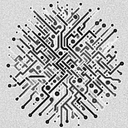

---
hide:
  - navigation
  - toc
---

  <header class="rz-header">
    
    

      <strong>Rhizomatics Open Source Software</strong>
      Home Assistant &middot; MQTT &middot;  Docker &middot; Self-Hosting
    

  </header>

  

    <a href="https://autoarm.rhizomatics.org.uk" class="rz-pill" target="_blank" rel="noopener">
      🛡️
      

        <strong>AutoArm</strong>
        Automatically arm Home Assistant alarm panels using calendars, presence, mobile actions, sun state and conditions
      

      ↗
    </a>

    <a href="https://supernotify.rhizomatics.org.uk" class="rz-pill" target="_blank" rel="noopener">
      🔔
      

        <strong>Supernotify</strong>
        Unified notification for Home Assistant with chimes, voice announcements, camera snapshots, PTZ movements and more
      

      ↗
    </a>

    <a href="https://updates2mqtt.rhizomatics.org.uk" class="rz-pill" target="_blank" rel="noopener">
      🐳
      

        <strong>Updates2MQTT</strong>
        Use Home Assistant's Updates dialog for self-hosted Docker container updates, with one-click pull and restart
      

      ↗
    </a>

    <a href="https://anpr2mqtt.rhizomatics.org.uk" class="rz-pill" target="_blank" rel="noopener">
      📷
      

        <strong>anpr2mqtt</strong>
        Integrate with ANPR cameras via the file system, create Home Assistant entities for plate reads and content, with optional UK DVLA lookup
      

      ↗
    </a>

    <a href="https://github.com/rhizomatics/ha_remote_logger" class="rz-pill" target="_blank" rel="noopener">
      🪵
      

        <strong>Remote Logger</strong>
        OTEL and Syslog native remote structured logging for Home Assistant
      

      ↗
    </a>

    <a href="https://github.com/rhizomatics/awesome-mqtt/tree/main" class="rz-pill" target="_blank" rel="noopener">
      📡
      

        <strong>Awesome MQTT</strong>
        The latest and greatest curated list of all things MQTT &mdash; brokers, clients, tools, and resources
      

      ↗
    </a>

  

